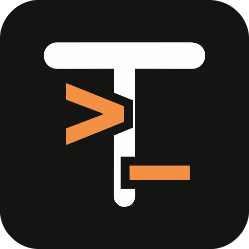

# Termix for Framely



基于 [Termix 官方仓库](https://github.com/Termix-SSH/Termix)的 Web 版本开发。插件列表、Dock 和快捷面板统一使用 [Termix 官方图标](https://github.com/Termix-SSH/Termix/raw/main/public/icon.svg)；保留原始 SVG，PNG 用于 Framely 插件清单。快捷面板底部显示插件版本、Termix 版本及上游仓库链接。

完整离线 ARM64 插件，ID `tooru.termix`。Termix 2.9.0 的 Web 前端、后端和 34 个上游内置模块随包交付；附带 Node.js、原生依赖、OPKSSH 和 guacd。设备无需安装 Node、npm 或 Docker。

所有设置位于快捷面板。先保存 Web 用户名和至少 6 位且包含字母和数字的密码，再开启服务。“打开”按钮通过 localhost iframe 在 Framely 大窗口显示完整 Termix。大窗口通过 Framely 桥接签发的 30 秒一次性凭据自动登录，无需重复输入密码；内网 IP 访问仍需登录。窗口关闭不会关闭服务。

HTTP 默认端口 **19627**，HTTPS 默认端口 **19628**；端口可修改。HTTPS 默认开启，HTTP 默认关闭。首次 HTTPS 访问需信任本机证书，快捷面板可将证书导出至 Frame 的 Steam 用户 `~/Downloads` 并显示保存路径，也可查看 SHA256 指纹；导出无需浏览器下载支持。修改网卡地址可能更新证书，此时需重新信任。

默认只启用物理网卡的私有内网地址。其他接口列在快捷面板中，可逐个启用。公网地址、未选网卡及不相关私有子网始终拒绝；HTTP 和 WebSocket 使用相同规则。网络接口变化时关闭旧会话并重新绑定。内部 Termix、guacd 和窗口入口仅监听回环地址；对外网关只绑定选中接口的私有地址。

Web 账号和 Frame 系统账号分离。插件运行身份为 Steam 会话用户；首次开启建立只允许回环来源的专用 SSH 密钥，并预置 Frame 本机连接。不会修改系统密码或开启 root 登录。`sshd` 须已在 Frame 上运行；sudo 仍由系统策略决定。关闭服务会停止 Termix 和 guacd，卸载会移除本插件添加的 SSH 授权；用户数据默认保留。

语言默认跟随 Framely。SDK `framely.language.get()` 返回 `{ preference, language }`，`language.changed` 事件通知变化。手动选择后保存覆盖设置；Termix 使用上游的 35 种语言。快捷面板支持中文和英文，默认直接跟随 SDK 返回的 Framely 当前语言；切换宿主语言会立即更新面板，其他语言回退英文。手动语言覆盖同时用于面板和 Termix Web。Web 内单独修改的语言偏好不会被默认语言同步覆盖。

## 构建

需要已取消网络隔离、支持 `localWeb` 窗口、SDK 语言接口及大包的新版 Framely。插件无需权限声明；运行用户为 `steamos`，大窗口使用 `ui.windows.main.localWeb: true`。Termix 自身的内网访问规则及账号登录验证继续生效。实测最终安装包 **250.21 MiB**；运行环境解包 **691.52 MiB**，加上已安装插件的运行环境 ZIP 等文件约需 **952 MiB**，另需数据库和升级临时空间。保留更新旧运行环境会增加磁盘占用。设备需要 Python 3、`ip` 和 `ssh-keygen`，这些不会通过 npm 安装。

```sh
npm ci
python3 scripts/upstream.py
npm run typecheck
npm test
npm run build
framely pack --manifest manifest.json --payload payload --output dist/tooru.termix-0.1.8.framely
framely verify dist/tooru.termix-0.1.8.framely
```

`scripts/upstream.py` 在 ARM64 Linux 上从固定提交构建，不使用 Docker；需要 Node >=22.12、npm、Python、make 和 C++ 编译器。它下载 Node 26.10.0、OPKSSH 0.16.0、固定摘要的 guacd 1.6.0 ARM64 镜像层，并校验摘要。可通过 `TERMIX_RUNTIME_SOURCE` 指定独立构建的运行环境 ZIP。所有联网和 npm 安装仅发生在开发机，发行安装包完整离线运行。

上游提交：`3643e7af97c6a597ad09db51d12676faa1dfc87c`。构建时给 Termix 增加仅经 Node IPC 使用的账号、语言、大窗口会话和 Frame 连接适配器，并让内部 HTTP 端口从环境读取；其他功能沿用上游。不会使用 Electron 的免登录模式。

```sh
python3 tests/integration.py
TERMIX_TEST_FRAME_SEED=1 python3 tests/integration.py
python3 tests/guacd-smoke.py
npm run dev
```

集成测试使用独立测试数据目录，仅启用回环客户端；默认跳过本机 SSH 授权，`TERMIX_TEST_FRAME_SEED=1` 使用隔离的测试 HOME 验证连接预置和授权清理，始终不会修改真实 HOME。覆盖真实离线启动、大窗口自动登录、一次性凭据及内外入口隔离、账号登录、改密保留连接密码、旧会话失效、语言、HTTP/HTTPS 和停止释放端口。guacd 测试验证 RDP/VNC/Telnet/SSH 原生模块加载，不连接远程主机。预览使用合成数据，不修改系统。真实 Frame 的 CEF 大窗口、SSH/SFTP、远程桌面、VR 键盘及实机资源占用仍需设备验收。

`python3 scripts/pack.py` 可使用 Python 的原生 zlib 快速打包；之后同样使用新版 `framely verify` 校验。

## 上游与许可证

插件控制与管理界面使用 MIT 许可证。Termix 使用 Apache-2.0，其内置 SDK 使用 MIT；guacd 使用 Apache-2.0。Node 和各个 npm／系统库保留各自许可证。运行包保留上游 LICENSE、Node LICENSE、依赖许可证与 guacd 镜像内的包记录。

- https://github.com/Termix-SSH/Termix/tree/3643e7af97c6a597ad09db51d12676faa1dfc87c
- https://github.com/openpubkey/opkssh/releases/tag/v0.16.0
- https://guacamole.apache.org/releases/1.6.0/
- https://nodejs.org/dist/v26.10.0/

上游功能若依赖外部服务（例如 OIDC、Vault、Docker 或远程主机），仍需要用户配置对应服务。插件不自动安装这些服务或更改 Frame 的系统保护。

## GitHub Actions 发布

与 passthrough-color 插件采用相同流程：推送与 `manifest.version` 一致的 `v*` 标签，或在该标签上手动运行 **Release plugin**。ARM64 runner 构建完整上游运行环境、运行单元及真实离线集成测试，生成 `.framely` 与 `SHA256SUMS`，随后创建 GitHub Release。上游运行环境通过 Actions cache 复用，发布包仍包含全部离线依赖；缓存未命中时从固定上游版本重新构建。

发布成功后，**Register plugin in database** 注册相应版本到数据库分支。仓库需要配置 Actions 变量 `DATABASE_REPOSITORY`（作者数据库仓库 `owner/repository`）和 Secret `DATABASE_TOKEN`（有该数据库写入权限）。正式版本进入 `main`，预发行版本进入 `testing`。也可手动运行注册工作流重试已发布版本。

```sh
git tag v0.1.8
git push origin v0.1.8
```

根目录 `icon.png` 是插件清单及快捷面板共同使用的官方图标，原始 SVG 保留在 `assets/icon.svg`。
